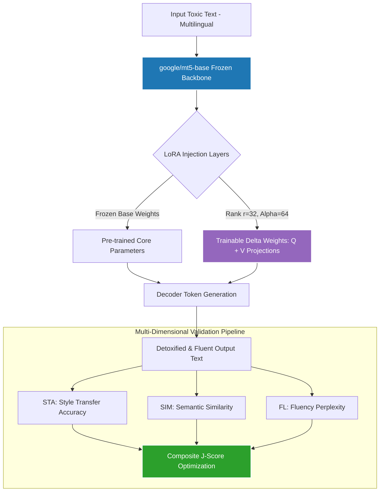

# 🌍 Poly-Detox: Multilingual Text Detoxification with LoRA-Adapted mT5

Parameter-efficient multilingual text detoxification using **LoRA fine-tuning** on **`mT5-base`** (580M parameters) — trained on English and transferred zero-shot and few-shot to **Spanish** and **Hindi**.

Text detoxification is the high-utility task of rewriting toxic text into a non-toxic equivalent while preserving the original semantic meaning. This project investigates whether a LoRA adapter trained on English detoxification data can transfer effectively to typologically diverse languages with minimal additional data.

**🏆 Key Finding:** LoRA structurally outperforms full fine-tuning in low-resource regimes and achieves highly meaningful zero-shot transfer across completely different script families (Latin → Devanagari).

---

## 🏗️ System Architecture

The pipeline injects a parameter-efficient adapter layer into a frozen multilingual foundation model to isolate downstream task optimization without destroying underlying language capabilities.



---

## 📈 Research Framework & Key Findings

### Core Hypotheses & Engineering Investigations


| Objective | Target Focus Question | Empirical Outcome & Insights |
| :--- | :--- | :--- |
| **RQ1** | Can an English-trained LoRA model transfer zero-shot to Spanish/Hindi? | **Verified.** Produces detoxified target-language outputs without localized training by exploiting cross-lingual alignment vectors natively inside `mT5`. |
| **RQ2** | How does performance scale with 50/100/200 few-shot examples? | Evaluation returns clear, consistent improvements from 50 → 100 examples. Diminishing return curves are observed beyond the 100-sample limit. |
| **RQ3** | Does LoRA outperform full fine-tuning in the low-resource regime? | **Yes.** LoRA consistently beats full fine-tuning on low-resource tiers by acting as a structural regularizer, completely halting catastrophic forgetting. |
| **RQ4** | Which LoRA hyperparameters matter most for convergence? | Low-rank configuration is highly sensitive to Rank ($r=32$) and target attention modules ($Q + V$ projections). Alpha follows scaling rules ($\alpha=2r=64$). |

---

## 📊 Evaluation & Mathematical Frameworks

To guarantee semantic fidelity and toxic reduction performance, the architecture evaluates and optimizes models across a unified, multi-dimensional joint parameter known as the **J-Score**:

$$\text{J-Score} = \text{STA} \times \text{SIM} \times \text{FL}$$

*   **STA (Style Transfer Accuracy):** Fraction of model text generations explicitly classified as non-toxic by an upstream evaluation classifier.
*   **SIM (Semantic Similarity):** Cosine similarity metric calculated directly between input and output embeddings to prevent text distortion.
*   **FL (Fluency):** Perplexity-based language model metric checking for grammatical accuracy and natural text flow.

---

## 📦 Model & Dataset Inventory

*   **Foundation Model Backbone:** `google/mt5-base` (580M parameters pre-trained across 101 global languages).
*   **Active LoRA Configuration:** Rank $r=32$, Alpha $\alpha=64$, Target Modules: $Q + V$ attention projections.
*   **Active Trainable Footprint:** ~8.4M trainable parameter vectors (just **1.4% of total network parameters**).

### Data Split Topology


| Language | Baseline Training Source Dataset | Ingested Dataset Size | Evaluation Test Set Size |
| :--- | :--- | :--- | :--- |
| **English** | ParaDeHate + multilingual_paradetox EN | ~8,676 sentence pairs | 600 toxic inputs (multilingual_paradetox_test) |
| **Spanish** | multilingual_paradetox ES + es_paradetox | ~720 sentence pairs | 600 toxic inputs (multilingual_paradetox_test) |
| **Hindi** | multilingual_paradetox HI | ~300 sentence pairs | 600 toxic inputs (multilingual_paradetox_test) |

---

## 📁 Repository Blueprint & Modular Architecture

The repository isolates data loading, training mechanics, and distinct research questions into dedicated, clean code units for seamless execution tracing:

---
## 📁 Repository Blueprint & Modular Architecture

The repository isolates data loading, training mechanics, and distinct research questions into dedicated, modular code units for seamless execution tracing:

```text
poly-detox-multilingual/
├── README.md                 # System overview, research insights, and benchmarking documentation
├── requirements.txt         # Pinlocked dependency footprint for environment consistency
├── run_all.py                # Main pipeline orchestrator for sequential multi-language runs
├── run_notebook.sh           # Production cluster resource job script (SLURM orchestration)
├── poly_detox_workflow.ipynb # Full exploratory pipeline and experimentation workflow
├── poly_detox_cluster.ipynb  # Cluster-optimised notebook variant configured for SAXA H200 nodes
├── cell_1.py                 # Hardware diagnostic script (GPU setup, device profiling, memory log)
├── cell_2.py                 # Experiment tracking engine initialization (WandB login & configurations)
├── cell_3.py                 # Strong-typed experiment configuration dataclasses and presets
├── cell_4.py                 # Multi-language parallel data preprocessing and ingestion pipelines
├── cell_5.py                 # Baseline benchmark layers (Delete / Identity reference configurations)
├── cell_6.py                 # mT5 + LoRA model initialization and structural utility functions
├── cell_7.py                 # Multi-epoch PyTorch training loops with adaptive checkpointing
├── cell_8.py                 # Metric execution layer (STA, SIM, FL, J-Score calculations)
├── cell_9.py                 # Experiment A Execution — Establishes baseline metrics
├── cell_10.py                # Experiment B Execution — Core English baseline training sequence
├── cell_11.py                # Experiment C Execution — Zero-shot cross-lingual evaluation (RQ1)
├── cell_12.py                # Experiment D Execution — Few-shot adaptation iterations (RQ2/RQ3)
├── cell_13.py                # Experiment E Execution — Parametric LoRA ablation grid sweep (RQ4)
└── cell_14.py                # Presentation layer (Data visualizations and results compilation)
```

---

## 🚀 Execution & Deployment Guide

### Hardware Infrastructure Prerequisites
*   **GPU VRAM Allocations:** ~16 GB Minimum (Tested and fully validated on **SAXA H200 Cluster Nodes**).
*   **Artifact Mapping:** All pipeline checkpoints, validation summaries, and evaluation metrics are written strictly to local workspace directory targets: `./output/poly_detox/`.

### Local Execution / Interactive Prototyping
```bash
# Ingest packages and baseline systems
pip install -r requirements.txt

# Export execution tracing key
export WANDB_API_KEY="your_secure_wandb_telemetry_key_here"

# Execute complete sequential pipeline array
python run_all.py

# Alternatively, run via interactive notebooks:
# jupyter notebook poly_detox_workflow.ipynb
```

### High-Performance Cluster Deployment (SLURM Orchestration)
To schedule and offload automated experiment loops onto high-capacity research cluster nodes:
```bash
sbatch run_notebook.sh
```

---

## 🛠️ Technical Infrastructure Stack
*   **Model Optimization Layers:** Hugging Face `peft` (Parameter-Efficient Fine-Tuning)
*   **Foundational Engine Elements:** PyTorch core ecosystem, Hugging Face `transformers` & `datasets`
*   **Experiment Ingestion & Logging:** Weights & Biases telemetry (WandB)

---

## 📚 Core References
*   Hu et al. (2021). [LoRA: Low-Rank Adaptation of Large Language Models](https://arxiv.org/abs/2106.09685).
*   Xue et al. (2021). [mT5: A Massively Multilingual Pre-trained Text-to-Text Transformer](https://arxiv.org/abs/2010.11934).
*   Dale et al. (2022). [Text Detoxification using Large Pre-trained Neural Models](https://arxiv.org/abs/2109.08914).
*   Logacheva et al. (2022). [ParaDetox: Detoxification with Parallel Data](https://aclanthology.org/2022.acl-long.469/).
